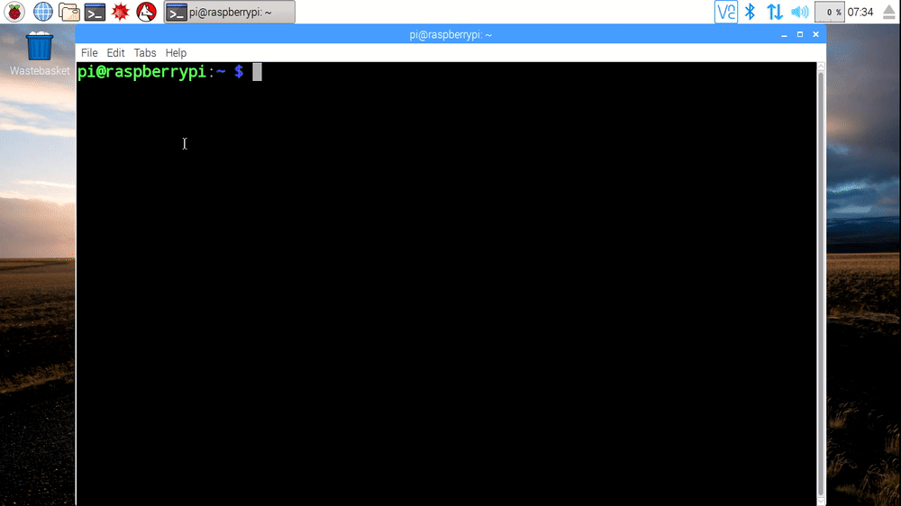

Υπάρχουν δύο τρόποι για την αντιγραφή αρχείων στο Raspberry Pi. Ο πρώτος χρησιμοποιεί το γραφικό περιβάλλον και ο δεύτερος χρησιμοποιεί το τερματικό.

### Μέθοδος 1 - Χρήση του γραφικού περιβάλλοντος επικοινωνίας - GUI

- Άνοιξε ένα παράθυρο του διαχειριστή αρχείων κάνοντας κλικ στο εικονίδιο στην επάνω αριστερή γωνία της οθόνης

   

- Πήγαινε στο αρχείο ή τον κατάλογο που θέλεις να αντιγράψεις και κάνε δεξί κλικ σε αυτό, επιλέγοντας *Αντιγραφή* από το αναδυόμενο μενού.
- Πήγαινε στον κατάλογο στον οποίο θέλεις να αντιγράψεις τα αρχεία ή τους καταλόγους.
- Κάνε δεξί κλικ στον κατάλογο και επίλεξε *Επικόλληση* από το αναδυόμενο μενού.
- Μπορείς επίσης να χρησιμοποιήσεις μιά επιλογή τύπου *lasso* για να επιλέξεις πολλά αρχεία και καταλόγους.

   

### Μέθοδος 2 - Χρήση του τερματικού

- Άνοιξε ένα νέο παράθυρο τερματικού κάνοντας κλικ στο εικονίδιο στην επάνω αριστερή γωνία της οθόνης.

   

- Χρησιμοποιήστε την εντολή `cp` για να αντιγράψεις αρχεία. Η σύνταξη είναι η εξής:

   ~~~bash
   cp αρχικός-κατάλογος/κατάλογος-αρχείο-για-αντιγραφή.txt.
   ~~~

- Εάν θέλεις να αντιγράψεις πολλά αρχεία, τότε μπορείς να χρησιμοποιήσεις το χαρακτήρα *μπαλαντέρ* `*`.

   ~~~bash
   cp αρχικός-κατάλογος/* κατάλογος-προορισμού/.
   ~~~

   

- Για να αντιγράψεις έναν κατάλογο που περιέχει αρχεία, πρέπει να κάνεις ένα *αναδρομικό* αντίγραφο. Αυτό μπορεί να γίνει τοποθετώντας τη σημαία `-r` μετά την εντολή `cp`

   ~~~bash
   cp-r αρχικός-κατάλόγος κατάλόγος-προορισμού
   ~~~

   
