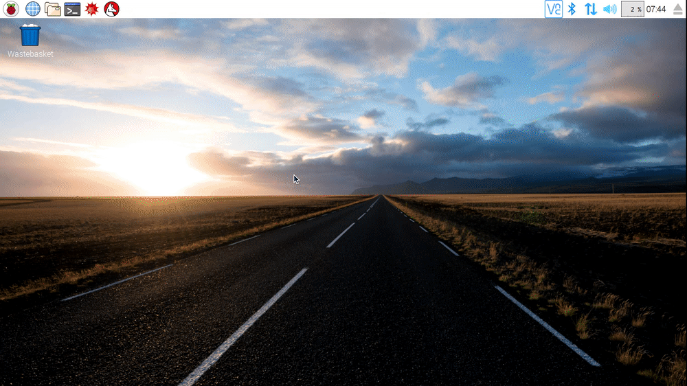

There are two ways to copy files on the Raspberry Pi. The first uses the GUI, and the second uses the Terminal.

### Method 1 - Using the GUI

- Open a File Manager window by clicking on the icon in the top left corner of the screen

   

- Navigate to the file or directory you want to copy and right-click on it, selecting *Copy* from the context menu.
- Navigate to the directory you wish to copy the files or directories into.
- Right-click in the directory and select *Paste* from the context menu.
- You can also use a *lasso* selection to select multiple files and directories.

   

### Method 2 - Using the Terminal

- Open a new Terminal window by clicking on the icon in the top left corner of the screen.

   

- Use the `cp` command to copy files. The syntax is as follows:

   ~~~bash
   cp source-directory/file-to-copy.txt destination-directory/.
   ~~~

- If you want to copy multiple files, then you can use the *wildcard* character `*`.

   ~~~bash
   cp source-directory/* destination-directory/.
   ~~~

   

- To copy a directory that contains files, you need to do a *recursive* copy. This can be done by placing the `-r` flag after the `cp` command

   ~~~bash
   cp -r source-directory destination-directory
   ~~~

   
